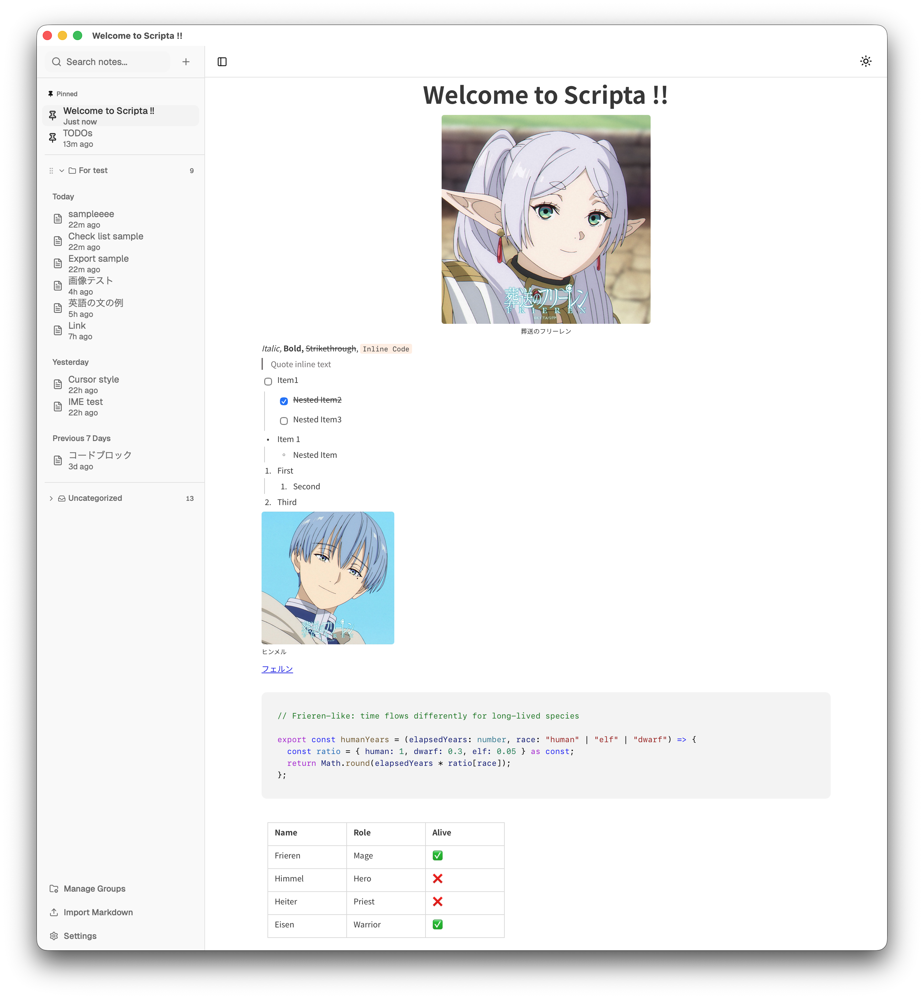

<div align="center">

# Scripta



[](https://github.com/j4rviscmd/Scripta/releases/latest)
[](https://github.com/j4rviscmd/Scripta/releases/latest)
[](https://github.com/j4rviscmd/Scripta/releases)<br/>
[](https://github.com/j4rviscmd/Scripta/releases/latest)
[](https://github.com/j4rviscmd/Scripta/commits/main)
[](https://github.com/j4rviscmd/Scripta/actions/workflows/ci.yml)
[](LICENSE)

<!-- markdownlint-disable MD001 -->
### A beautifully simple note app that works offline

No accounts, no cloud, no subscriptions. Just your notes, on your computer.

</div>

---

## Why Scripta?

Most note apps want you online, signed in, and paying. Scripta doesn't.

- **Completely offline** — Your notes never leave your computer. No accounts, no cloud, no tracking.
- **Instant and lightweight** — Opens in under a second. No loading spinners, no sync delays.
- **Distraction-free writing** — A clean, calm interface that gets out of your way.
- **100% free** — No subscriptions, no feature gates, no ads. Ever.

## Features

### Rich Editor

Write the way you want — with headings, lists, checklists, code blocks, tables, images, quotes, dividers, and more. Formatting is as simple as selecting text or typing `/` to open the command palette.

- Drag and drop images directly into your notes
- Syntax-highlighted code blocks with 30+ languages
- Highlight, bold, italic, strikethrough, and colored text
- Find and replace with regex support

### Organize Your Way

Keep your notes tidy with **groups**, **pinned notes**, and **search**.

- Create custom groups and drag notes between them
- Pin important notes to the top
- Notes are automatically sorted by date — today, yesterday, last 7 days, and more
- Search by title to find anything instantly

### Markdown Import & Export

Bring your notes in, take them out. Scripta supports Markdown import and export, so you're never locked in.

### Typewriter Mode

Stay focused with **cursor centering** — the line you're writing always stays in the center of the screen, so you never have to look down.

### Smart Links

Paste a URL and Scripta automatically fetches the page title, turning an ugly link into a readable one.

### Customizable Toolbar

Show only the formatting buttons you use. Hide the rest. Reorder them however you like.

### Themes & Fonts

Switch between **light**, **dark**, or **system** themes. Choose from **1,900+ Google Fonts** to personalize your writing experience.

### Remembers Where You Left Off

Scripta remembers which note you had open, where you were scrolled to, and where your cursor was. Just pick up where you left off.

## Keyboard Shortcuts

|       Action       |        Shortcut         |
| ------------------ | ----------------------- |
| New note           | `Ctrl/Cmd + N`          |
| Search notes       | `Ctrl/Cmd + F`          |
| Zoom in / out      | `Ctrl/Cmd + Plus/Minus` |
| Toggle sidebar     | `Ctrl/Cmd + B`          |
| Export as Markdown | `Ctrl/Cmd + Shift + E`  |

## Installation

Download the latest version from the [Releases](https://github.com/j4rviscmd/Scripta/releases/latest) page.

|         Platform          |                                                           Download                                                           |
| ------------------------- | ---------------------------------------------------------------------------------------------------------------------------- |
| **macOS (Apple Silicon)** | [Scripta_macOS_arm64.dmg](https://github.com/j4rviscmd/Scripta/releases/latest/download/Scripta_macOS_arm64.dmg)             |
| **macOS (Intel)**         | [Scripta_macOS_x64.dmg](https://github.com/j4rviscmd/Scripta/releases/latest/download/Scripta_macOS_x64.dmg)                 |
| **Windows**               | [Scripta_Windows_x64-setup.exe](https://github.com/j4rviscmd/Scripta/releases/latest/download/Scripta_Windows_x64-setup.exe) |

> [!NOTE]
> macOS builds are not signed. On first launch, run:
>
> ```bash
> xattr -dr com.apple.quarantine "/Applications/Scripta.app"
> ```

## Your Data, Your Control

All your notes are stored locally on your computer. Nothing is sent to any server.

- Notes are saved in your system's standard app data folder
- Images you add are stored alongside your notes
- Export any note to Markdown at any time

> [!TIP]
> Custom storage location support is coming in a future update.

<details>
<summary>Default data locations</summary>

- **macOS**: `~/Library/Application Support/com.scripta.app/`
- **Windows**: `%APPDATA%\com.scripta.app\`

</details>

## Contributing

Issues and PRs are welcome.

## License

MIT License — see [LICENSE](./LICENSE) for details.
